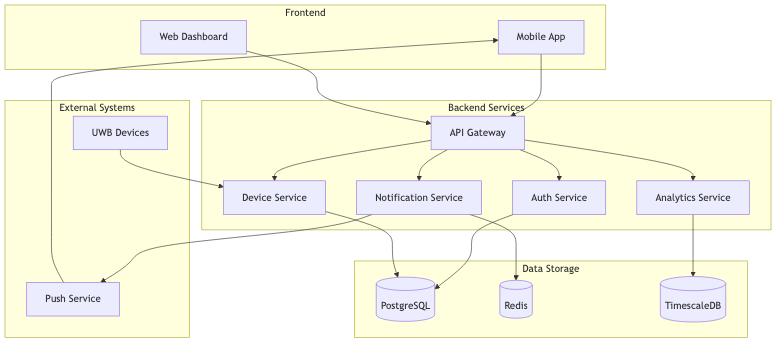
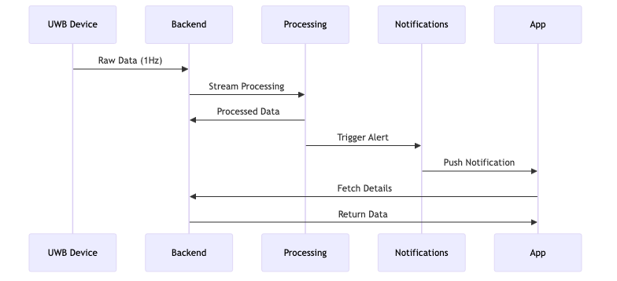

# MATE HOME 2 - Analisi Funzionale Dettagliata

## 1. Panoramica del Sistema

MATE HOME 2 è un sistema avanzato di monitoraggio assistenziale progettato per offrire un supporto completo nella cura e nell'assistenza di persone anziane o che necessitano di supervisione costante. Il sistema si distingue per la sua capacità di fornire informazioni in tempo reale sullo stato e le attività dell'assistito, garantendo al contempo privacy e dignità.

### 1.1 Architettura del Sistema



L'architettura del sistema è stata progettata secondo i principi di scalabilità, affidabilità e sicurezza, articolandosi in tre componenti principali:

#### App Mobile (iOS/Android)
L'applicazione mobile rappresenta l'interfaccia principale per caregiver e familiari. È stata sviluppata utilizzando React Native per garantire:
- **Prestazioni Native**: L'app offre un'esperienza fluida e reattiva su entrambe le piattaforme
- **Interfaccia Intuitiva**: Design user-friendly che permette un accesso immediato alle informazioni critiche
- **Notifiche in Tempo Reale**: Sistema di notifiche push per eventi significativi
- **Monitoraggio Continuo**: Visualizzazione dello stato attuale e storico delle attività

#### Backend Server
Il cuore del sistema, responsabile dell'elaborazione dati e della logica di business:
- **Microservizi**: Architettura modulare per maggiore scalabilità e manutenibilità
- **API Gateway**: Punto di accesso unificato e sicuro per tutte le richieste
- **Sistema di Notifiche**: Elaborazione e distribuzione intelligente delle notifiche
- **Gestione Dati**: Storage sicuro e efficiente dei dati sensibili

#### Sensori e Dispositivi
La rete di sensori radar UWB (Ultra-Wide Band) fornisce:
- **Rilevamento Presenza**: Monitoraggio non invasivo della presenza nelle stanze
- **Analisi Movimento**: Identificazione di pattern di movimento e potenziali anomalie
- **Parametri Ambientali**: Monitoraggio di temperatura, umidità e luminosità
- **Privacy Preservata**: Nessuna telecamera o dispositivo invasivo

### 1.2 Flusso dei Dati



Il flusso dei dati è stato ottimizzato per garantire:
- **Latenza Minima**: Tempo di risposta inferiore a 200ms per le informazioni critiche
- **Affidabilità**: Sistema di retry automatico in caso di errori di comunicazione
- **Sicurezza**: Crittografia end-to-end di tutti i dati sensibili
- **Efficienza**: Ottimizzazione del consumo di banda e risorse

## 2. Funzionalità Core

### 2.1 Dashboard Principale

La dashboard è il punto di accesso principale alle informazioni del sistema. È stata progettata per fornire una visione immediata e completa dello stato dell'assistito.

#### Componenti Principali

##### Status Card
Visualizza lo stato attuale dell'assistito:
```typescript
interface StatusCard {
  presence: boolean;          // Presenza nella stanza
  activity: ActivityLevel;    // Livello di attività
  lastMovement: Date;        // Ultimo movimento rilevato
  environmentals: {
    temperature: number;      // Temperatura ambiente
    humidity: number;         // Umidità relativa
    light: number;           // Livello di illuminazione
  }
}
```

**Comportamento**:
- Aggiornamento in tempo reale (polling ogni 30 secondi)
- Indicatori visivi per cambiamenti di stato
- Animazioni fluide per transizioni
- Gesture per interazioni rapide

##### Activity Timeline
Cronologia delle attività nelle ultime 24 ore:
```typescript
interface ActivityEvent {
  type: 'movement' | 'rest' | 'absence';
  startTime: Date;
  duration: number;
  intensity?: number;
}
```

**Visualizzazione**:
- Grafico interattivo con zoom e pan
- Codifica colori per diversi tipi di attività
- Dettagli on-demand con tap
- Filtri per tipo di attività

### 2.2 Sistema di Notifiche

Il sistema di notifiche è stato progettato per mantenere i caregiver informati sugli eventi significativi, minimizzando al contempo il rischio di "alert fatigue".

#### Tipi di Notifica

##### Notifiche di Movimento
```typescript
interface MovementAlert {
  type: 'movement';
  severity: 'info' | 'warning' | 'critical';
  location: Room;
  timestamp: Date;
  description: string;
  metadata: {
    intensity: number;
    duration: number;
    pattern: string;
  }
}
```

**Logica di Generazione**:
- Analisi continua dei pattern di movimento
- Rilevamento anomalie basato su ML
- Contestualizzazione temporale (giorno/notte)
- Personalizzazione per utente

##### Notifiche Ambientali
```typescript
interface EnvironmentalAlert {
  type: 'environmental';
  parameter: 'temperature' | 'humidity' | 'light';
  value: number;
  threshold: {
    min: number;
    max: number;
  };
  timestamp: Date;
}
```

**Gestione**:
- Monitoraggio continuo dei parametri
- Soglie configurabili
- Aggregazione intelligente
- Prioritizzazione automatica

### 2.3 Monitoraggio Bagno

Il modulo di monitoraggio bagno è stato sviluppato con particolare attenzione alla privacy e alla sicurezza dell'assistito.

#### Funzionalità Principali

##### Rilevamento Occupazione
```typescript
interface BathroomStatus {
  occupied: boolean;
  duration: number;
  lastVisit: {
    start: Date;
    end: Date;
    duration: number;
  };
  analytics: {
    dailyVisits: number;
    averageDuration: number;
    unusualPatterns: boolean;
  }
}
```

**Caratteristiche**:
- Rilevamento non invasivo
- Analisi temporale delle visite
- Identificazione pattern anomali
- Alert per durate eccessive

##### Statistiche e Analisi
Il sistema mantiene statistiche dettagliate per:
- Frequenza delle visite
- Durata media
- Pattern giornalieri
- Anomalie comportamentali

### 2.4 Gestione Dispositivi

Il modulo di gestione dispositivi garantisce il corretto funzionamento dell'infrastruttura hardware.

#### Monitoraggio Sensori
```typescript
interface DeviceStatus {
  id: string;
  type: 'radar' | 'environmental';
  battery: number;
  signal: number;
  lastHeartbeat: Date;
  errors: DeviceError[];
  configuration: DeviceConfig;
}
```

**Funzionalità**:
- Monitoraggio stato batteria
- Qualità del segnale
- Diagnostica remota
- Aggiornamenti OTA

## 3. Aspetti Tecnici

### 3.1 Sicurezza

La sicurezza è una priorità fondamentale del sistema:

#### Autenticazione
- OAuth 2.0 con refresh token
- Biometria opzionale
- Session management
- Rate limiting

#### Protezione Dati
- Crittografia end-to-end
- Anonimizzazione
- Backup automatici
- Audit logging

### 3.2 Performance

Obiettivi di performance:

#### Frontend
- First Load: < 2s
- Time to Interactive: < 1s
- Frame Rate: 60fps
- Offline Support

#### Backend
- Latenza API: < 200ms
- Uptime: 99.9%
- Throughput: 1000 req/s
- Auto-scaling

## 4. Roadmap di Sviluppo

### 4.1 Fase Attuale
- Implementazione core features
- Testing con utenti pilota
- Ottimizzazione performance
- Documentazione tecnica

### 4.2 Prossimi Sviluppi
- Integrazione ML per pattern recognition
- Espansione analytics
- API pubbliche
- Mobile app 2.0

## 5. Note Implementative

### 5.1 Stack Tecnologico
- **Frontend**: React Native, TypeScript, Redux
- **Backend**: Node.js, Express, PostgreSQL
- **Infrastructure**: AWS, Docker, Kubernetes
- **Monitoring**: ELK Stack, Prometheus

### 5.2 Best Practices
- Clean Architecture
- Test-Driven Development
- Continuous Integration
- Documentation as Code
